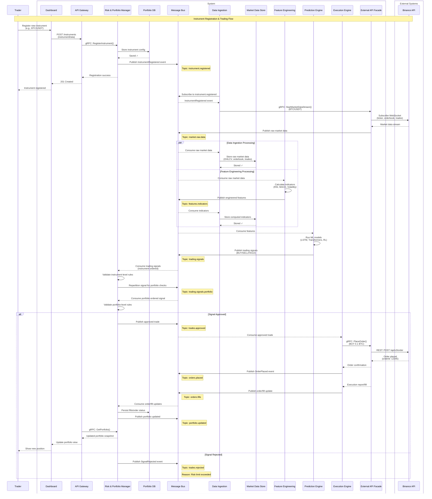

# Trading Bot Platform Architecture

## Table of Contents
- [Trading Bot Platform Architecture](#trading-bot-platform-architecture)
  - [Table of Contents](#table-of-contents)
  - [Architecture summary](#architecture-summary)
  - [Eventing, Ordering, and Consistency](#eventing-ordering-and-consistency)
  - [Kafka Topics and Partition Keys](#kafka-topics-and-partition-keys)
  - [Fills Reconciliation and Source of Truth](#fills-reconciliation-and-source-of-truth)
  - [ML Training and Deployment (Placeholder)](#ml-training-and-deployment-placeholder)
  - [C4 Model Diagrams](#c4-model-diagrams)
  - [Workflows of Trading Bot Platform](#workflows-of-trading-bot-platform)
    - [Registering a new trading instrument and executing trades](#registering-a-new-trading-instrument-and-executing-trades)

## Architecture summary

The trading bot platform is designed to facilitate automated trading by integrating various components that handle data ingestion, feature engineering, prediction generation, risk management, and trade execution. The architecture leverages microservices, message queues, and external APIs to ensure scalability, reliability, and real-time processing.

Main components include:
- **User Interface (Dashboard)**: A web-based interface for traders to register instruments, monitor portfolios, and view trading signals.
- **API Gateway**: Acts as a single entry point for all client requests, routing them to appropriate backend services.
- **Risk & Portfolio Manager**: Manages instrument registrations, portfolio data, and enforces risk management rules.
- **Message Bus (Kafka)**: Facilitates asynchronous communication between services through event-driven architecture, with a schema registry for event contracts and versioning.
- **Data Ingestion Service**: Subscribes to market data streams and stores raw data in a time-series database.
- **Feature Engineering Service**: Processes raw market data to compute technical indicators and other features.
- **Prediction Engine**: Utilizes machine learning models to generate trading signals based on engineered features.
- **Execution Engine**: Validates approved trades and interacts with external trading APIs to place orders.

## Eventing, Ordering, and Consistency

- **Schema governance**: All Kafka topics are versioned and validated through a schema registry to prevent breaking changes and enable safe evolution.
- **Ordering boundaries**: Strict ordering for risk checks is implemented as a two-stage flow: instrument-ordered stream first, then a portfolio-ordered repartition stream.
- **Idempotency**: Trade approvals and fill events carry idempotency keys to guard against retries and replay.

## Kafka Topics and Partition Keys

The platform uses explicit partition keys so ordering behavior is deterministic and auditable.

Key conventions:
- `instrument_key = <exchange>:<instrument_id>`
- `portfolio_key = <portfolio_id>`
- `risk_key = <portfolio_id>:<instrument_id>` (used inside payloads and for deduplication/idempotency)

Risk ordering strategy:
- Stage 1 (instrument checks): consume `trading.signals` keyed by `instrument_key`.
- Stage 2 (portfolio checks): republish passing events to `trading.signals.portfolio` keyed by `portfolio_key`.
- Final decision: publish `trades.approved` or `trades.rejected` keyed by `portfolio_key`.

| Topic | Producer | Main consumers | Partition key | Ordering guarantee |
| --- | --- | --- | --- | --- |
| `instrument.registered` | Risk & Portfolio Manager | Data Ingestion | `instrument_key` | Per instrument |
| `market.raw.data` | External API Facade | Data Ingestion, Feature Engineering | `instrument_key` | Per instrument |
| `features.indicators` | Feature Engineering | Prediction Engine, Data Ingestion | `instrument_key` | Per instrument |
| `trading.signals` | Prediction Engine | Risk & Portfolio Manager (instrument stage) | `instrument_key` | Per instrument |
| `trading.signals.portfolio` | Risk & Portfolio Manager (repartition stage) | Risk & Portfolio Manager (portfolio stage) | `portfolio_key` | Per portfolio |
| `trades.approved` | Risk & Portfolio Manager | Execution Engine | `portfolio_key` | Per portfolio |
| `trades.rejected` | Risk & Portfolio Manager | Downstream adapters (audit/monitoring/dashboard) | `portfolio_key` | Per portfolio |
| `orders.placed` | Execution Engine | Risk & Portfolio Manager | `portfolio_key` | Per portfolio |
| `orders.fills` | Execution Engine | Risk & Portfolio Manager | `portfolio_key` | Per portfolio |
| `portfolio.updated` | Risk & Portfolio Manager | Downstream adapters and analytics | `portfolio_key` | Per portfolio |

Current retention policy:
- No topics are configured as compacted at this stage; all topics are append-only event streams with time/size retention.

## Fills Reconciliation and Source of Truth

The Risk & Portfolio Manager is the system of record for orders, fills, and portfolio state. The Execution Engine emits order and fill updates to Kafka, and the Risk & Portfolio Manager consumes these events to persist final state and emit portfolio-updated/order-updated events for downstream services and the dashboard.
Portfolio and trade read queries exposed to clients are served by Risk & Portfolio Manager (via API Gateway), not by Execution Engine.

## ML Training and Deployment (Placeholder)

Model training and deployment are intentionally left out of the current scope. A future addition will cover:
- Offline training and evaluation pipeline
- Model registry and versioned artifacts
- Feature store or feature lineage for offline/online consistency
- Deployment strategy and rollback for Prediction Engine models

## C4 Model Diagrams

The C4 model diagrams for the trading bot platform are available in the `docs/architecture/c4` directory. These diagrams provide a visual representation of the system's components, their interactions, and the overall architecture. To view the diagrams interactively in the browser, run the following script:

```bash
./scripts/structurizr-lite.sh
```

## Workflows of Trading Bot Platform

Below are represented a detailed sequence diagrams illustrating different workflows of a trading bot platform. This diagram captures the interactions between various components, including user interfaces, backend services, data ingestion, feature engineering, prediction engines, risk management, and trade execution.

### Registering a new trading instrument and executing trades

When a trader wants to register a new trading instrument (e.g., BTC/USDT) and execute trades based on generated signals, the following sequence of interactions occurs:


