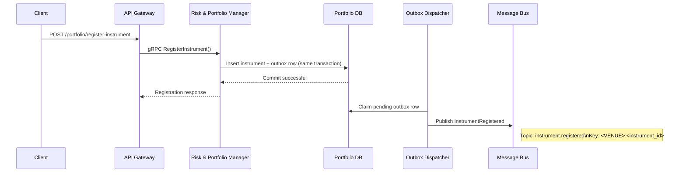
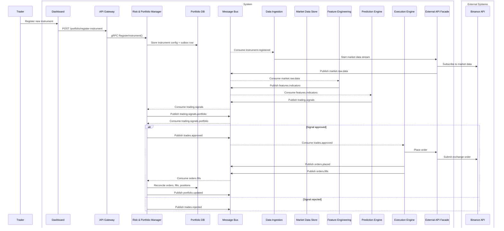

# Trading Bot Platform Architecture

## Table of Contents

- [Trading Bot Platform Architecture](#trading-bot-platform-architecture)
  - [Table of Contents](#table-of-contents)
  - [Architecture Summary](#architecture-summary)
  - [Current Implementation Status](#current-implementation-status)
  - [Target Architecture](#target-architecture)
  - [Eventing, Ordering, and Consistency](#eventing-ordering-and-consistency)
    - [Current event transport contract](#current-event-transport-contract)
    - [Ordering and idempotency rules](#ordering-and-idempotency-rules)
    - [Versioning rules](#versioning-rules)
    - [Outbox pattern](#outbox-pattern)
  - [Kafka Topics and Partition Keys](#kafka-topics-and-partition-keys)
  - [Local Development Workflow](#local-development-workflow)
  - [C4 Model Diagrams](#c4-model-diagrams)
  - [Workflows](#workflows)
    - [Current: Instrument Registration](#current-instrument-registration)
    - [Planned: End-to-End Trading Flow](#planned-end-to-end-trading-flow)

## Architecture Summary

The platform is an event-driven trading system built around small services, explicit Kafka topic contracts, and service-owned datastores.

Two principles are already active in the current codebase and should remain stable as the MVP grows:

- Business state changes are committed to Postgres before being published to Kafka.
- Kafka topics, keys, and event metadata are treated as explicit contracts, not ad-hoc strings.

The current implementation is still intentionally narrow:

- `api-gateway` exposes the registration REST path.
- `portfolio-manager` stores instruments, writes an outbox record, and dispatches Kafka events.
- `common` owns shared proto contracts and Kafka contract helpers.
- Local infra provides Redpanda, Postgres, and TimescaleDB.

Everything else in this document should be read as either:

- implemented now, or
- planned target state, explicitly marked below.

## Current Implementation Status

| Area                             | Status               | Notes                                                                           |
| -------------------------------- | -------------------- | ------------------------------------------------------------------------------- |
| API Gateway                      | Implemented          | REST entrypoint forwards registration to `portfolio-manager` over gRPC.         |
| Risk & Portfolio Manager         | Implemented          | Instrument registration, Postgres persistence, outbox storage, Kafka dispatch.  |
| Outbox Dispatcher                | Implemented          | Kafka publish happens from the outbox, not inline with the DB write.            |
| Shared Contracts (`common`)      | Implemented          | Proto types, topic constants, key builders, and Kafka header helpers live here. |
| Message Bus (Redpanda/Kafka API) | Implemented          | Local development uses Redpanda.                                                |
| Portfolio DB (Postgres)          | Implemented          | Source of truth for current registration flow and outbox storage.               |
| Market Data Store (TimescaleDB)  | Implemented in infra | Provisioned locally, but not yet exercised by application code in this repo.    |
| Data Ingestion Service           | Planned              | Not implemented in this repo yet.                                               |
| Feature Engineering Service      | Planned              | Not implemented in this repo yet.                                               |
| Prediction Engine                | Planned              | Not implemented in this repo yet.                                               |
| Execution Engine                 | Planned              | Not implemented in this repo yet.                                               |
| External API Facade              | Planned              | Not implemented in this repo yet.                                               |
| Dashboard                        | Planned              | Not implemented in this repo yet.                                               |
| Schema Registry                  | Planned              | Documented as a future capability; not provisioned in local infra.              |

## Target Architecture

The intended MVP direction remains:

- `instrument.registered` starts per-instrument downstream activity.
- `trading.signals` is consumed in instrument order.
- `trading.signals.portfolio` is the repartitioned portfolio-order stage.
- `trades.approved` and `trades.rejected` are the risk decision outputs.
- `orders.placed` and `orders.fills` come from the execution engine.
- `portfolio.updated` is emitted by the risk and portfolio manager after reconciliation.

That target architecture is still valid, but only the registration slice is implemented today.

## Eventing, Ordering, and Consistency

### Current event transport contract

Kafka messages use:

- Kafka record key as the authoritative partition key
- protobuf domain payload in the message value
- metadata in Kafka headers

Standard headers:

- `event-id`
- `event-type`
- `schema-version`
- `occurred-at`
- `producer`
- `content-type`

For Iteration 1:

- `event-type` is the topic name
- `schema-version` starts at `"1"`
- `event-id` is the outbox row ID and stays stable across retries
- `content-type` is `application/x-protobuf`

### Ordering and idempotency rules

- `instrument_key = <VENUE>:<instrument_id>`
- `portfolio_key = <portfolio_id>`
- `risk_key = <portfolio_id>:<instrument_id>`
- `instrumentKey()` normalizes `venue` to uppercase before joining the key.
- The outbox row ID is the idempotency identity for the current registration event flow.

### Versioning rules

- Additive protobuf field additions are allowed on the same topic.
- Breaking semantic changes require a new documented event type or topic and a new schema version.
- Schema registry is still planned, so version discipline is currently enforced by shared contracts, tests, and documentation.

### Outbox pattern

`portfolio-manager` does not publish Kafka events directly from the write path. It:

1. writes the business record,
2. writes an outbox row in the same transaction,
3. dispatches the outbox row to Kafka asynchronously.

This is the main currently implemented reliability mechanism and should remain visible in both the code and diagrams.

## Kafka Topics and Partition Keys

Local development bootstraps all documented topics explicitly and disables broker auto-creation so topic-name mistakes fail fast.

| Topic                       | Status      | Producer                                             | Main consumers                                      | Partition key    | Ordering guarantee |
| --------------------------- | ----------- | ---------------------------------------------------- | --------------------------------------------------- | ---------------- | ------------------ |
| `instrument.registered`     | Implemented | Risk & Portfolio Manager                             | Planned Data Ingestion                              | `instrument_key` | Per instrument     |
| `market.raw.data`           | Planned     | Planned External API Facade                          | Planned Data Ingestion, Feature Engineering         | `instrument_key` | Per instrument     |
| `features.indicators`       | Planned     | Planned Feature Engineering                          | Planned Prediction Engine, Data Ingestion           | `instrument_key` | Per instrument     |
| `trading.signals`           | Planned     | Planned Prediction Engine                            | Planned Risk & Portfolio Manager (instrument stage) | `instrument_key` | Per instrument     |
| `trading.signals.portfolio` | Planned     | Planned Risk & Portfolio Manager (repartition stage) | Planned Risk & Portfolio Manager (portfolio stage)  | `portfolio_key`  | Per portfolio      |
| `trades.approved`           | Planned     | Planned Risk & Portfolio Manager                     | Planned Execution Engine                            | `portfolio_key`  | Per portfolio      |
| `trades.rejected`           | Planned     | Planned Risk & Portfolio Manager                     | Planned downstream adapters                         | `portfolio_key`  | Per portfolio      |
| `orders.placed`             | Planned     | Planned Execution Engine                             | Planned Risk & Portfolio Manager                    | `portfolio_key`  | Per portfolio      |
| `orders.fills`              | Planned     | Planned Execution Engine                             | Planned Risk & Portfolio Manager                    | `portfolio_key`  | Per portfolio      |
| `portfolio.updated`         | Planned     | Planned Risk & Portfolio Manager                     | Planned downstream adapters and analytics           | `portfolio_key`  | Per portfolio      |

Local bootstrap defaults:

- partitions: `3`
- replication factor: `1`
- cleanup policy: `delete`

No compacted topics are configured at this stage.

## Local Development Workflow

Expected env files:

- root `.env`
  - `PORTFOLIO_MANAGER_GRPC_URL`
  - `KAFKA_BROKERS`
  - optional `PORT` for `api-gateway`
- `apps/portfolio-manager/.env`
  - `DATABASE_URL`
- `apps/portfolio-manager/.env.test-integration`
  - isolated integration-test `DATABASE_URL`
  - isolated integration-test `KAFKA_BROKERS`
- `infra/.env`
  - Postgres and Timescale credentials for Docker Compose

Suggested local run order:

```bash
docker compose -f infra/docker-compose.yml up -d
npx nx run portfolio-manager:migrate
npx nx serve portfolio-manager
npx nx serve api-gateway
```

If local Kafka topics need to be re-created after startup, rerun:

```bash
docker compose -f infra/docker-compose.yml run --rm redpanda-init
```

Useful validation commands:

```bash
npx nx run portfolio-manager:test-integration
```

`portfolio-manager:test-integration` uses the isolated
`infra/docker-compose.test.yml` stack, bootstraps topics via `redpanda-init`,
runs `portfolio-manager:migrate:test-integration`, and then executes the
integration Jest suite. It does not require the shared local development stack
to be running first.

Manual registration smoke:

1. Start infra and both apps.
2. Call `POST /portfolio/register-instrument` on `api-gateway`.
3. Consume from `instrument.registered`.
4. Verify key, headers, and decoded `InstrumentRegistered` payload.

## C4 Model Diagrams

The C4 model diagrams live in `docs/architecture/c4`.

To view them interactively:

```bash
./scripts/structurizr-lite.sh
```

## Workflows

### Current: Instrument Registration

This is the implemented flow today.


```mermaid
sequenceDiagram
    participant Client
    participant APIGateway as API Gateway
    participant PortfolioManager as Risk & Portfolio Manager
    participant DB as Portfolio DB
    participant Outbox as Outbox Dispatcher
    participant Kafka as Message Bus

    Client->>APIGateway: POST /portfolio/register-instrument
    APIGateway->>PortfolioManager: gRPC RegisterInstrument()
    PortfolioManager->>DB: Insert instrument + outbox row (same transaction)
    DB-->>PortfolioManager: Commit successful
    PortfolioManager-->>APIGateway: Registration response
    Outbox->>DB: Claim pending outbox row
    Outbox->>Kafka: Publish InstrumentRegistered
    Note right of Kafka: Topic: instrument.registered\nKey: <VENUE>:<instrument_id>
```

### Planned: End-to-End Trading Flow

The flow below is the intended target architecture, not the current repo state.


```mermaid
sequenceDiagram
    participant Trader

    box System
    participant Dashboard
    participant APIGateway as API Gateway
    participant RiskManager as Risk & Portfolio Manager
    participant DB as Portfolio DB
    participant Kafka as Message Bus
    participant DataIngestion as Data Ingestion
    participant TimescaleDB as Market Data Store
    participant FeatureEng as Feature Engineering
    participant PredictionEngine as Prediction Engine
    participant ExecutionEngine as Execution Engine
    participant ExternalAPI as External API Facade
    end

    box External Systems
    participant Binance as Binance API
    end

    Trader->>Dashboard: Register new instrument
    Dashboard->>APIGateway: POST /portfolio/register-instrument
    APIGateway->>RiskManager: gRPC RegisterInstrument()
    RiskManager->>DB: Store instrument config + outbox row
    Kafka-->>DataIngestion: Consume instrument.registered

    DataIngestion->>ExternalAPI: Start market data stream
    ExternalAPI->>Binance: Subscribe to market data
    ExternalAPI->>Kafka: Publish market.raw.data

    Kafka-->>FeatureEng: Consume market.raw.data
    FeatureEng->>Kafka: Publish features.indicators

    Kafka-->>PredictionEngine: Consume features.indicators
    PredictionEngine->>Kafka: Publish trading.signals

    Kafka-->>RiskManager: Consume trading.signals
    RiskManager->>Kafka: Publish trading.signals.portfolio
    Kafka-->>RiskManager: Consume trading.signals.portfolio

    alt Signal approved
        RiskManager->>Kafka: Publish trades.approved
        Kafka-->>ExecutionEngine: Consume trades.approved
        ExecutionEngine->>ExternalAPI: Place order
        ExternalAPI->>Binance: Submit exchange order
        ExecutionEngine->>Kafka: Publish orders.placed
        ExecutionEngine->>Kafka: Publish orders.fills
        Kafka-->>RiskManager: Consume orders.fills
        RiskManager->>DB: Reconcile orders, fills, positions
        RiskManager->>Kafka: Publish portfolio.updated
    else Signal rejected
        RiskManager->>Kafka: Publish trades.rejected
    end
```
