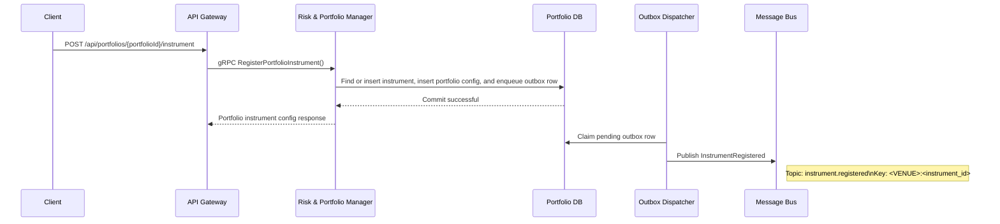
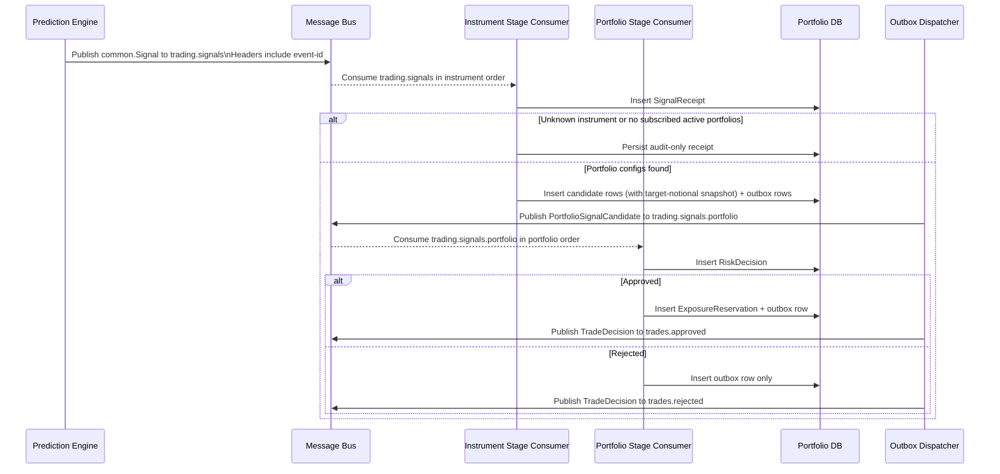
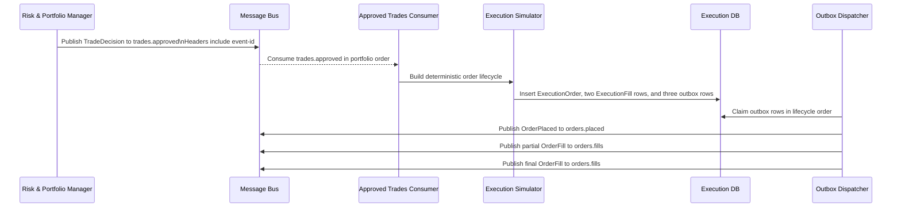
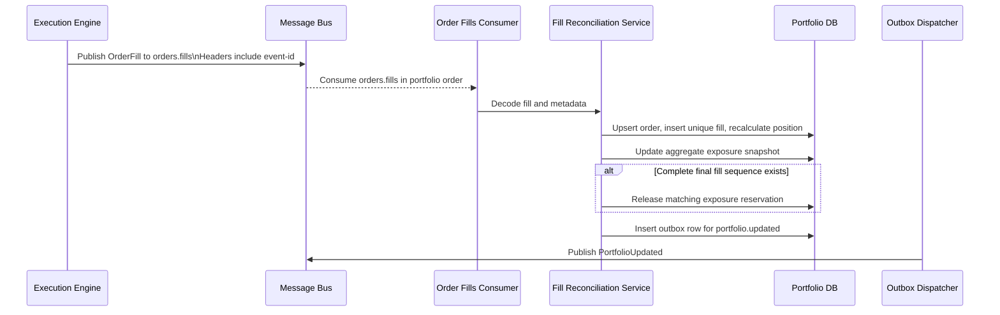
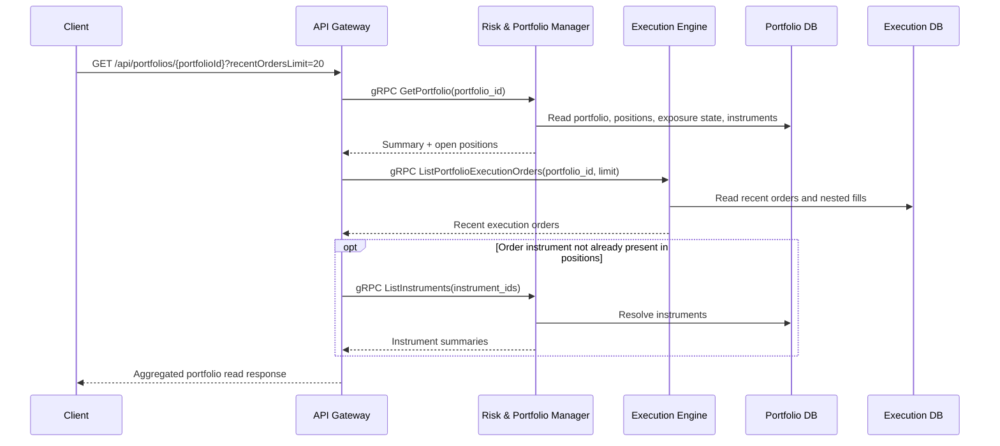
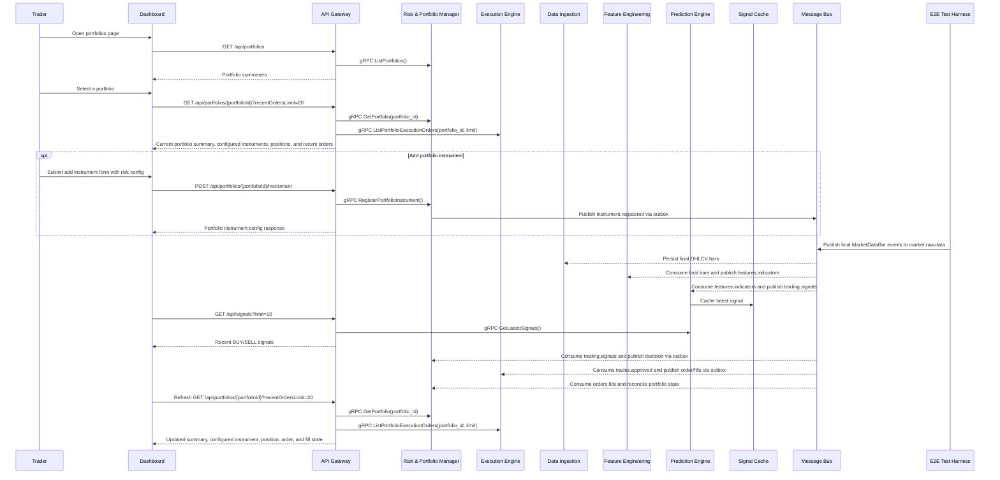
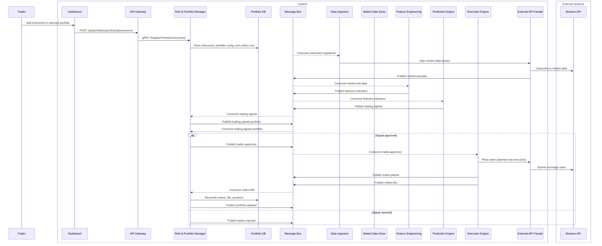

# Trading Bot Platform Architecture

## Table of Contents

- [Trading Bot Platform Architecture](#trading-bot-platform-architecture)
  - [Table of Contents](#table-of-contents)
  - [Architecture Summary](#architecture-summary)
  - [Current Implementation Status](#current-implementation-status)
  - [Remaining MVP Gaps](#remaining-mvp-gaps)
  - [Target Architecture](#target-architecture)
  - [Eventing, Ordering, and Consistency](#eventing-ordering-and-consistency)
    - [Current event transport contract](#current-event-transport-contract)
    - [Ordering and idempotency rules](#ordering-and-idempotency-rules)
    - [Consumer retry and DLQ policy](#consumer-retry-and-dlq-policy)
    - [Metrics and runbooks](#metrics-and-runbooks)
    - [Versioning rules](#versioning-rules)
    - [Outbox pattern](#outbox-pattern)
  - [Kafka Topics and Partition Keys](#kafka-topics-and-partition-keys)
  - [Local Development Workflow](#local-development-workflow)
  - [C4 Model Diagrams](#c4-model-diagrams)
  - [Workflows](#workflows)
    - [Current: Portfolio Instrument Configuration](#current-portfolio-instrument-configuration)
    - [Current: Risk Pipeline](#current-risk-pipeline)
    - [Current: Execution Simulator](#current-execution-simulator)
    - [Current: Fill Reconciliation](#current-fill-reconciliation)
    - [Current: Portfolio Read API and Execution Visibility](#current-portfolio-read-api-and-execution-visibility)
    - [Current: Signal-To-Portfolio E2E Flow](#current-signal-to-portfolio-e2e-flow)
    - [Planned: End-to-End Trading Flow](#planned-end-to-end-trading-flow)

## Architecture Summary

The platform is an event-driven trading system built around small services, explicit Kafka topic contracts, and service-owned datastores.

Two principles are already active in the current codebase and should remain stable as the MVP grows:

- Business state changes are committed to Postgres before being published to Kafka.
- Kafka topics, keys, and event metadata are treated as explicit contracts, not ad-hoc strings.

The current implementation is still intentionally narrow:

- `api-gateway` exposes portfolio listing, portfolio visibility reads,
  portfolio-scoped instrument configuration, and CORS for the local dashboard
  origin.
- `portfolio-manager` stores instruments, runs the current two-stage risk pipeline, writes outbox records, and dispatches Kafka events.
- `execution-engine` consumes approved trades, persists deterministic simulated order lifecycles, writes outbox records, and dispatches order events.
- `common` owns shared proto contracts and Kafka contract helpers.
- `common` also owns the reusable Kafka consumer retry/DLQ wrapper and Prometheus metric helpers used by implemented services.
- `external-api-facade` manages Binance WebSocket kline subscriptions and publishes raw market data directly to Kafka (no outbox — streaming workload where a missed candle is reproduced by the next tick).
- `data-ingestion` consumes `instrument.registered` and `market.raw.data`, persists OHLCV bars to TimescaleDB, and exposes `GetMarketDataBars` over gRPC.
- `feature-engineering` consumes final `market.raw.data` bars, warms rolling
  state from Data Ingestion, computes core indicator feature vectors, and
  publishes `features.indicators`.
- `prediction-engine` consumes `features.indicators`, runs deterministic
  `baseline-core-v1` inference, publishes BUY/SELL `common.Signal` events to
  `trading.signals`, caches recent signals in Redis, and exposes
  `Signals.GetLatestSignals` over gRPC.
- `dashboard` provides the React portfolio dashboard for portfolio selection,
  portfolio visibility, recent signal visibility, and portfolio-scoped
  instrument configuration.
- Local infra provides Redpanda, Postgres, TimescaleDB, and Redis.

Everything else in this document should be read as either:

- implemented now, or
- planned target state, explicitly marked below.

## Current Implementation Status

| Area                             | Status         | Notes                                                                                                                                                                                                                                                                                                                                                                               |
| -------------------------------- | -------------- | ----------------------------------------------------------------------------------------------------------------------------------------------------------------------------------------------------------------------------------------------------------------------------------------------------------------------------------------------------------------------------------- |
| API Gateway                      | Implemented    | REST entrypoint lists portfolios, forwards portfolio-scoped instrument configuration to `portfolio-manager`, aggregates portfolio/execution visibility over gRPC, and allows configured dashboard CORS origins.                                                                                                                                                                     |
| Risk & Portfolio Manager         | Implemented    | Instrument registration, the two-stage risk pipeline, fill reconciliation, portfolio read queries, and instrument resolution are implemented in `portfolio-manager`.                                                                                                                                                                                                                |
| Outbox Dispatcher                | Implemented    | Kafka publish happens from the outbox, not inline with the DB write; shared dispatch mechanics live in `common`.                                                                                                                                                                                                                                                                    |
| Shared Contracts (`common`)      | Implemented    | Proto types, topic constants, key builders, Kafka header helpers, and reusable outbox dispatch ports live here.                                                                                                                                                                                                                                                                     |
| Message Bus (Redpanda/Kafka API) | Implemented    | Local development uses Redpanda.                                                                                                                                                                                                                                                                                                                                                    |
| Portfolio DB (Postgres)          | Implemented    | Source of truth for instruments, outbox rows, portfolios, risk decisions, exposure reservations, reconciled orders/fills, positions, and portfolio summary snapshots.                                                                                                                                                                                                               |
| Market Data Store (TimescaleDB)  | Implemented    | Provisioned locally and exercised by Data Ingestion. OHLCV bars are written by the `data-ingestion` service after consuming `market.raw.data` events.                                                                                                                                                                                                                               |
| Data Ingestion Service           | Implemented    | Rust service. Consumes `instrument.registered` → starts Binance kline subscription via External API Facade. Consumes `market.raw.data` → persists OHLCV bars to TimescaleDB. Exposes `GetMarketDataBars` gRPC API for API Gateway. Startup re-subscription from portfolio-manager `ListInstruments`. DLQ publishing for both consumers. Integration tests require live TimescaleDB. |
| Feature Engineering Service      | Implemented    | Rust service consumes final `market.raw.data`, warms rolling state from Data Ingestion, computes core per-instrument indicators, and publishes `features.indicators`. No feature persistence/read API yet.                                                                                                                                                                           |
| Prediction Engine                | Implemented    | Python service consumes `features.indicators`, runs deterministic `baseline-core-v1` inference, skips neutral decisions, publishes BUY/SELL `common.Signal` events to `trading.signals`, writes recent signals to Redis, exposes `Signals.GetLatestSignals` over gRPC, and reports Prometheus metrics.                                                                             |
| Execution Engine                 | Implemented    | Event simulator consumes approved trades, emits deterministic placed/fill lifecycle events, and exposes execution-owned order/fill read queries over gRPC.                                                                                                                                                                                                                          |
| Execution DB (Postgres schema)   | Implemented    | Source of truth for simulated orders, fills, and execution outbox rows.                                                                                                                                                                                                                                                                                                             |
| Reliability & Operability        | Implemented    | Implemented consumers use bounded retry, per-topic DLQs, correlation/causation headers, structured logs, and Prometheus metrics endpoints.                                                                                                                                                                                                                                          |
| External API Facade              | Implemented    | NestJS service. Manages Binance WebSocket kline subscriptions. `StartMarketDataSubscription` / `StopMarketDataSubscription` gRPC API. Publishes `MarketDataBar` protobuf events directly to `market.raw.data` (no outbox — high-frequency streaming; a missed candle is reproduced by the next WebSocket tick). Prometheus metrics endpoint.                                        |
| Dashboard                        | Implemented    | Nx React/Vite/Tailwind dashboard lists portfolios, reads selected portfolio state, displays recent BUY/SELL signals, and adds instruments to the selected portfolio through API Gateway only.                                                                                                                                                                                       |
| Full-System E2E                  | Implemented    | Dedicated `trading-bot-e2e` Nx/Playwright project depends on the shared `infra` Nx project for isolated Docker lifecycle, runs migrations and seed data, starts backend services and dashboard, drives raw bars through Feature Engineering and Prediction Engine, and verifies REST plus browser-visible state.                                                                    |
| Schema Registry                  | Planned        | Documented as a future capability; not provisioned in local infra.                                                                                                                                                                                                                                                                                                                  |

## Remaining MVP Gaps

The backend event chain, market data ingestion, dashboard visibility, and
full-system e2e coverage are implemented through portfolio and market-data read
visibility. The remaining near-term work is post-MVP capability expansion:

- Polish local setup documentation and env examples so the MVP is reproducible
  from a clean checkout.
- Keep `README.md` as the canonical local validation walkthrough, with the
  architecture, C4 model, infra notes, roadmap, and reliability runbooks linked
  from that entrypoint.
- Keep the boundary between product APIs and test-harness Kafka publishing
  explicit. Synthetic `trading.signals` publishing exists for e2e/manual test
  tooling only.

Operational documentation gaps to keep visible:

- Clean-checkout command order must stay documented in `README.md`.
- Local env examples and committed integration/e2e env files must stay aligned
  with runtime validation code and Nx target wiring.
- Smoke-test docs must use the implemented plural API Gateway paths under
  `/api/portfolios`.
- The MVP limitations below must stay clear so planned target architecture is
  not mistaken for implemented behavior.

Current implementation limitations:

- No feature persistence/read API for indicator history or Dashboard overlays.
- No production model registry or training pipeline.
- No cross-instrument correlations; the implemented Feature Engineering slice
  is per-instrument/per-interval.
- No real exchange or paper exchange execution (External API Facade implements Binance kline subscriptions; order placement is planned).
- No auth, users, or permissions.
- No websocket/live Dashboard stream or indicator chart overlays.
- No production deployment story.
- No schema registry.

Implemented full-system e2e boundary:

- `npx nx run trading-bot-e2e:e2e` starts an isolated Docker Compose project
  through `infra:serve-e2e`, runs both Prisma migration sets, seeds
  `portfolio-alpha`, starts `portfolio-manager`, `execution-engine`,
  `external-api-facade`, `data-ingestion`, `feature-engineering`,
  `prediction-engine`, `api-gateway`, and `dashboard`, publishes final raw bars
  to `market.raw.data`, verifies the real feature/prediction/signal path,
  verifies the REST read response, and verifies the rendered Dashboard in
  Chromium.
- The e2e suite includes replay checks for both duplicate source signal
  `event-id` handling and duplicate final fill replay.
- Runtime values for Docker Compose e2e lifecycle live in `infra/.env.e2e`.
  Harness values live in `apps/trading-bot-e2e/.env.e2e`, and app
  `serve:e2e`, `migrate:e2e`, and `seed:e2e` target configurations load
  app-scoped `.env.e2e` files. The project JSON keeps command wiring, not
  duplicated env blocks.
- The `infra` project exposes `infra:clean-e2e:e2e` as the explicit Docker
  Compose cleanup target. `infra:serve-e2e:e2e` cleans stale e2e state before
  startup, and CI runs `infra:clean-e2e:e2e` again in an `always()` step after
  Nx has stopped continuous service targets.
- Synthetic signal and fill publishing are test-harness behavior only; they are
  not product APIs and are not exposed in the Dashboard. Synthetic signal
  publishing remains only as a fallback for tests that intentionally bypass
  Feature Engineering and Prediction Engine.

Documentation correction:

- Older roadmap text for Iteration 7 uses stale singular `/api/portfolio...`
  paths. The implemented and documented API Gateway surface uses plural
  `/api/portfolios...` paths.

Implemented Dashboard boundary:

- The dashboard uses only API Gateway product endpoints:
  - `GET /api/portfolios`
  - `GET /api/portfolios/:portfolioId?recentOrdersLimit=20`
  - `POST /api/portfolios/:portfolioId/instrument`
  - `GET /api/signals?instrumentId=&limit=`
- The dashboard has no hardcoded default portfolio. Users select a portfolio
  before portfolio details are loaded.
- Keep synthetic signal publishing out of product APIs. Direct Kafka signal
  publishing is test harness behavior, not a Dashboard or API Gateway feature.
- The dashboard intentionally has no signal injection, strategy editor, trading
  controls, market charts, websocket stream, or auth.

## Target Architecture

The intended MVP direction remains:

- `instrument.registered` starts per-instrument downstream activity.
- `trading.signals` is consumed in instrument order.
- `trading.signals.portfolio` is the repartitioned portfolio-order stage.
- `trades.approved` and `trades.rejected` are the risk decision outputs.
- `orders.placed` and `orders.fills` come from the execution engine.
- `portfolio.updated` is emitted by the risk and portfolio manager after reconciliation.

That target architecture is still valid. Today the repo implements registration,
market data ingestion, feature engineering, baseline prediction, the current
two-stage risk pipeline, a durable execution simulator, and fill
reconciliation. Real exchange execution remains planned.

For the MVP, the Dashboard exposes the implemented backend surface rather than
introduce new trading control APIs. It lists portfolios, reads selected
portfolio visibility, displays recent signals, and configures portfolio
instruments through API Gateway. Tests may still publish synthetic signals
directly to Kafka when intentionally bypassing prediction, but that publisher is
test tooling and is not part of the production container model.

## Eventing, Ordering, and Consistency

### Current event transport contract

Kafka messages use:

- Kafka record key as the authoritative partition key
- protobuf domain payload in the message value
- metadata in Kafka headers

Standard headers:

- `event-id`
- `event-type`
- `schema-version`
- `occurred-at`
- `producer`
- `content-type`
- `correlation-id`
- `causation-id` when the event is derived from another event
- `traceparent` when an upstream producer supplied W3C tracing context

Current payload boundaries:

- `instrument.registered` uses `InstrumentRegistered`.
- `trading.signals` reuses `common.Signal` from the prediction domain.
- `trading.signals.portfolio` uses `PortfolioSignalCandidate`.
- `trades.approved` and `trades.rejected` both use `TradeDecision`.
- `orders.placed` uses `OrderPlaced`.
- `orders.fills` uses `OrderFill`.
- `portfolio.updated` uses `PortfolioUpdated`.
- `*.dlq` topics use `DeadLetterEvent`.

The risk pipeline intentionally does not reuse `common.Signal` for downstream portfolio-scoped or decision-scoped topics. Those topics carry lifecycle-specific fields such as `source_event_id`, `portfolio_id`, decision kind, and reason codes.

Current event metadata conventions:

- `event-type` is the topic name
- `schema-version` starts at `"1"` per topic
- `event-id` is generated before the outbox row is written; for events published by `portfolio-manager`, that same value is stored as the outbox row ID and stays stable across retries
- `correlation-id` defaults to the inbound `correlation-id`, then inbound `event-id`, then the current event ID
- `causation-id` is the immediate source event ID for derived events
- execution simulator event IDs are deterministic: `<order_id>:placed`, `<order_id>:fill:1`, and `<order_id>:fill:2`
- `content-type` is `application/x-protobuf`

Risk pipeline payload notes:

- `Signal.id` is the business signal identity from the prediction domain.
- Kafka header `event-id` is the transport event identity and the source deduplication key for `trading.signals`.
- `PortfolioSignalCandidate.candidate_idempotency_key = <source_event_id>:<portfolio_id>`.
- `TradeDecision` is published to either `trades.approved` or `trades.rejected`; the topic name and embedded `decision` enum must agree.
- Risk limits, prices, notionals, and quantities are stored in Postgres `NUMERIC` columns and compared with Prisma `Decimal` values; binary floating-point is not used for approval decisions.

Execution simulator payload notes:

- `OrderPlaced.order_id = ord_<sha256(candidate_idempotency_key)[0..32]>`.
- `OrderPlaced.approval_event_id` is the inbound `trades.approved` Kafka header `event-id`.
- `OrderFill.fill_id` is the same value as its Kafka `event-id`.
- The default simulator emits one partial fill and one final fill. The first fill is 50% of the requested quantity/notional; the final fill is the exact remainder.
- Execution timestamps are logical offsets from `TradeDecision.decided_at`: placed at +1s, partial fill at +2s, final fill at +3s.
- Execution quantities, notionals, and prices are stored and transported as decimal strings.

Fill reconciliation payload notes:

- `portfolio-manager` consumes `orders.fills`; it does not consume `orders.placed` in the current implementation.
- `PortfolioUpdated` is emitted once for every accepted unique fill and carries a changed snapshot: portfolio ID, source fill ID, order ID, instrument ID, aggregate exposure notional, open position count, changed position quantity, changed position average entry price, changed position exposure notional, and update timestamp.
- Reconciled position quantities, average prices, exposures, fill quantities, and fill notionals are stored as Postgres `NUMERIC` values and transported as decimal strings.
- Signed net accounting is used: BUY fills increase quantity and SELL fills decrease quantity. Short positions are allowed in the MVP.

Current read API notes:

- `api-gateway` exposes `GET /api/portfolios` for portfolio summaries.
- `api-gateway` exposes `GET /api/portfolios/:portfolioId?recentOrdersLimit=20`.
- `api-gateway` exposes `POST /api/portfolios/:portfolioId/instrument` to
  create-or-attach an instrument to a selected portfolio with risk config.
- The detail endpoint aggregates portfolio state from `portfolio-manager` and recent execution order state from `execution-engine`; it does not read either service database directly.
- Portfolio read responses use decimal strings for money and quantities. They intentionally do not expose cash balances, available balance, realized PnL, or unrealized PnL because those are not modeled in the current portfolio database.
- Portfolio summary fields represent current exposure/read-model state: portfolio ID, name, active flag, exposure cap, aggregate exposure notional, open position count, and last read-model update time.
- Configured instruments include instrument details, enabled flag, target
  notional, max trade notional, max position notional, and update time.
- Positions include instrument summaries and exact decimal strings for quantity, average entry price, and exposure.
- Recent execution orders include execution-owned order identity, requested size, reference price, lifecycle timestamps, and nested fills. API Gateway enriches order instrument IDs through `portfolio-manager` instrument resolution when possible.
- The simulator still persists the immediate full placed/partial-fill/final-fill lifecycle. The read API can show execution-owned order/fill truth, but Iteration 5 does not introduce delayed placed-only state.

### Ordering and idempotency rules

- `instrument_key = <VENUE>:<instrument_id>`
- `portfolio_key = <portfolio_id>`
- `risk_key = <portfolio_id>:<instrument_id>`
- `instrumentKey()` normalizes `venue` to uppercase before joining the key.
- `trading.signals` is processed in Kafka partition order by `instrument_key`; payload timestamps are informational and do not reorder processing.
- `trading.signals.portfolio`, `trades.approved`, and `trades.rejected` are processed in Kafka partition order by `portfolio_key`.
- Source-signal deduplication is keyed by the inbound Kafka header `event-id`, persisted as `SignalReceipt.sourceEventId`.
- `SignalReceipt.sourceEventId` is unique; a replayed source event is treated as already processed and emits no new candidates.
- `PortfolioSignalCandidate.candidate_idempotency_key = <source_event_id>:<portfolio_id>`; exactly one candidate audit row can exist for a given source event and portfolio.
- `RiskDecision.candidateIdempotencyKey` is unique; exactly one final decision can exist for a given candidate and at most one reservation can be attached to it.
- For events emitted by `portfolio-manager`, the Kafka header `event-id` and the outbox row `id` are the same stable identity.
- `execution-engine` consumes `trades.approved` in portfolio order using the `portfolio_key`.
- `ExecutionOrder.approvalEventId` and `ExecutionOrder.candidateIdempotencyKey` are unique, so replaying the same approved trade does not create another order stream.
- `orders.placed` and `orders.fills` use `portfolio_key` and are enqueued with lifecycle sequence `1`, `2`, `3` so placed is dispatched before fills for a given simulated order.
- `portfolio-manager` consumes `orders.fills` in portfolio order using `portfolio_key`.
- `PortfolioFill.id` and `(orderId, sequence)` are unique, so replaying the same fill does not mutate portfolio state or emit another `portfolio.updated`.
- Position state is reproducible from persisted fills ordered by `filledAt`, fill sequence, and fill ID.
- Risk cap checks use filled position exposure plus active exposure reservations.
- A matching exposure reservation is released only after the order has a final fill and all fill sequences from `1..finalSequence` are present.

### Consumer retry and DLQ policy

Implemented Kafka consumers share the same reliability wrapper:

- total handler attempts: `5` by default
- exponential backoff defaults: `250ms`, `500ms`, `1s`, `2s`, capped by `KAFKA_CONSUMER_RETRY_MAX_MS`
- the original Kafka offset is committed only after handler success or after the DLQ publish succeeds
- if DLQ publish fails, the original offset is not committed and the broker can redeliver the source message
- DLQ messages keep the original Kafka key and carry a protobuf `DeadLetterEvent` with original topic, partition, offset, key, headers, value bytes, service, consumer group, attempts, error fields, and correlation/causation IDs

Outbox rows do not move to DLQ. A committed business event remains retryable in
the owning service database until Kafka accepts it.

### Metrics and runbooks

Prometheus metrics endpoints:

- API Gateway: `GET /metrics` on the existing HTTP app
- Portfolio Manager: Nest hybrid HTTP listener on `PORTFOLIO_MANAGER_METRICS_PORT`, default `9101`
- Execution Engine: Nest hybrid HTTP listener on `EXECUTION_ENGINE_METRICS_PORT`, default `9102`

The `/metrics` route is provided by `@willsoto/nestjs-prometheus`; application
metric updates still go through the shared `TradingBotMetrics` facade so unit
tests can use isolated registries.

Current metric families:

- `trading_bot_kafka_consumer_messages_total`
- `trading_bot_kafka_consumer_retries_total`
- `trading_bot_kafka_consumer_dlq_messages_total`
- `trading_bot_kafka_consumer_processing_seconds`
- `trading_bot_outbox_dispatch_total`
- `trading_bot_outbox_backlog`
- `trading_bot_outbox_oldest_pending_age_seconds`

Operational replay, stuck outbox, DLQ drain, and local failure drill steps live in
[Reliability Runbooks](../operations/reliability-runbooks.md).

### Versioning rules

- Additive protobuf field additions are allowed on the same topic.
- Breaking semantic changes require a new documented event type or topic and a new schema version.
- Schema registry is still planned, so version discipline is currently enforced by shared contracts, tests, and documentation.

### Outbox pattern

`portfolio-manager` does not publish Kafka events directly from the write path. It:

1. writes the business record,
2. writes an outbox row in the same transaction,
3. dispatches the outbox row to Kafka asynchronously.

This is the main currently implemented reliability mechanism and remains true for:

- `instrument.registered`
- `trading.signals.portfolio`
- `trades.approved`
- `trades.rejected`
- `portfolio.updated`

`execution-engine` uses the same reliability shape for:

- `orders.placed`
- `orders.fills`

The reusable dispatcher core lives in `common` as a repository/emitter driven
Kafka outbox dispatcher. Service apps keep their own outbox repositories because
each service owns its Prisma client, database schema, enqueue shape, and any
service-specific ordering column such as execution lifecycle sequence.

## Kafka Topics and Partition Keys

Local development bootstraps all documented topics explicitly and disables broker auto-creation so topic-name mistakes fail fast.

| Topic                           | Status                | Producer                                                 | Main consumers                                                 | Partition key    | Ordering guarantee |
| ------------------------------- | --------------------- | -------------------------------------------------------- | -------------------------------------------------------------- | ---------------- | ------------------ |
| `instrument.registered`         | Implemented           | Risk & Portfolio Manager                                 | Implemented Data Ingestion                                     | `instrument_key` | Per instrument     |
| `market.raw.data`               | Implemented           | Implemented External API Facade                          | Implemented Data Ingestion; Implemented Feature Engineering    | `instrument_key` | Per instrument     |
| `features.indicators`           | Implemented           | Implemented Feature Engineering                          | Implemented Prediction Engine                                 | `instrument_key` | Per instrument     |
| `trading.signals`               | Implemented           | Implemented Prediction Engine                            | Implemented Risk & Portfolio Manager (instrument stage)        | `instrument_key` | Per instrument     |
| `trading.signals.portfolio`     | Implemented           | Implemented Risk & Portfolio Manager (repartition stage) | Implemented Risk & Portfolio Manager (portfolio stage)         | `portfolio_key`  | Per portfolio      |
| `trades.approved`               | Implemented           | Implemented Risk & Portfolio Manager                     | Implemented Execution Engine                                   | `portfolio_key`  | Per portfolio      |
| `trades.rejected`               | Implemented           | Implemented Risk & Portfolio Manager                     | Planned downstream adapters                                    | `portfolio_key`  | Per portfolio      |
| `orders.placed`                 | Implemented           | Implemented Execution Engine simulator                   | Planned Risk & Portfolio Manager                               | `portfolio_key`  | Per portfolio      |
| `orders.fills`                  | Implemented           | Implemented Execution Engine simulator                   | Implemented Risk & Portfolio Manager                           | `portfolio_key`  | Per portfolio      |
| `portfolio.updated`             | Implemented           | Implemented Risk & Portfolio Manager                     | Planned downstream adapters and analytics                      | `portfolio_key`  | Per portfolio      |
| `trading.signals.dlq`           | Implemented           | Implemented Risk & Portfolio Manager consumer wrapper    | Operator replay workflow                                       | original key     | Per original key   |
| `trading.signals.portfolio.dlq` | Implemented           | Implemented Risk & Portfolio Manager consumer wrapper    | Operator replay workflow                                       | original key     | Per original key   |
| `trades.approved.dlq`           | Implemented           | Implemented Execution Engine consumer wrapper            | Operator replay workflow                                       | original key     | Per original key   |
| `orders.fills.dlq`              | Implemented           | Implemented Risk & Portfolio Manager consumer wrapper    | Operator replay workflow                                       | original key     | Per original key   |
| `instrument.registered.dlq`     | Implemented           | Implemented Data Ingestion consumer wrapper              | Operator replay workflow                                       | original key     | Per original key   |
| `market.raw.data.dlq`           | Implemented           | Implemented Data Ingestion consumer wrapper              | Operator replay workflow                                       | original key     | Per original key   |

Local bootstrap defaults:

- partitions: `3`
- replication factor: `1`
- cleanup policy: `delete`

No compacted topics are configured at this stage.

## Local Development Workflow

The canonical clean-checkout walkthrough lives in
[README.md](../../README.md). This section records the architecture-level
configuration boundaries and the Nx targets used by that walkthrough.

Expected env files:

- root `.env`
  - example: `.env.example`
  - shared runtime config loaded before app-local env files
  - `KAFKA_BROKERS`
  - `PORTFOLIO_MANAGER_GRPC_URL`
  - `EXECUTION_ENGINE_GRPC_URL`
  - optional `KAFKA_CONSUMER_RETRY_MAX_ATTEMPTS`, `KAFKA_CONSUMER_RETRY_BASE_MS`, `KAFKA_CONSUMER_RETRY_MAX_MS`
- `apps/api-gateway/.env`
  - example: `apps/api-gateway/.env.example`
  - API Gateway-owned runtime config loaded after root `.env`
  - `PORT`
  - optional `API_GATEWAY_CORS_ORIGINS` for dashboard browser access; defaults to `http://localhost:4200,http://127.0.0.1:4200`
- `apps/dashboard/.env`
  - example: `apps/dashboard/.env.example`
  - optional `VITE_API_BASE_URL`; defaults in code to `http://localhost:3000/api`
- `apps/portfolio-manager/.env`
  - example: `apps/portfolio-manager/.env.example`
  - `PORTFOLIO_MANAGER_DATABASE_URL`
  - optional `PORTFOLIO_MANAGER_METRICS_PORT`
- `apps/portfolio-manager/.env.test-integration`
  - committed isolated integration-test env file
  - isolated integration-test `PORTFOLIO_MANAGER_DATABASE_URL`
  - isolated integration-test `KAFKA_BROKERS`
  - isolated integration-test `PORTFOLIO_MANAGER_GRPC_URL` and
    `PORTFOLIO_MANAGER_METRICS_PORT`
- `apps/execution-engine/.env`
  - example: `apps/execution-engine/.env.example`
  - `EXECUTION_ENGINE_DATABASE_URL`
  - optional `EXECUTION_ENGINE_METRICS_PORT`
- `apps/execution-engine/.env.test-integration`
  - committed isolated integration-test env file
  - isolated integration-test `EXECUTION_ENGINE_DATABASE_URL`
  - isolated integration-test `KAFKA_BROKERS`
  - isolated integration-test `EXECUTION_ENGINE_GRPC_URL` and
    `EXECUTION_ENGINE_METRICS_PORT`
- `infra/.env.test-integration`
  - committed isolated integration-test env file
  - isolated integration-test Docker Compose host ports, including Kafka
    `19092` and Postgres `15432`, loaded by
    `infra:serve-integration:test-integration`
- `infra/.env.e2e`
  - committed isolated e2e env file
  - isolated e2e Docker Compose project name and host ports, including Kafka
    `29092` and Postgres `16432`, loaded by
    `infra:serve-e2e:e2e`, `infra:stop-e2e:e2e`, and `infra:clean-e2e:e2e`
- `apps/trading-bot-e2e/.env.e2e`
  - committed isolated e2e env file
  - isolated full-system e2e harness ports and Kafka broker defaults loaded by
    Nx for test harness behavior
  - the test harness Kafka producer and readiness check read `KAFKA_BROKERS`
- `apps/portfolio-manager/.env.e2e`
  - committed isolated e2e env file
  - e2e service process `PORTFOLIO_MANAGER_DATABASE_URL`, `KAFKA_BROKERS`, gRPC URL, and metrics
    port loaded by Nx for `portfolio-manager:serve:e2e`, plus seed/migration
    access for `portfolio-manager` e2e targets
- `apps/execution-engine/.env.e2e`
  - committed isolated e2e env file
  - e2e service process database URL, `KAFKA_BROKERS`, gRPC URL, and metrics
    port loaded by Nx for `execution-engine:serve:e2e` and migration access for
    `execution-engine:migrate:e2e`
- `apps/api-gateway/.env.e2e`
  - committed isolated e2e env file
  - e2e API Gateway port, CORS origins, and backend gRPC URLs loaded by Nx for
    `api-gateway:serve:e2e`
- `apps/dashboard/.env.e2e`
  - committed isolated e2e env file
  - e2e Vite host, dashboard port, and `VITE_API_BASE_URL` loaded by Nx for
    `dashboard:serve:e2e`
- `infra/.env`
  - example: `infra/.env.example`
  - Postgres and Timescale credentials for Docker Compose

Suggested local run order:

```bash
npx nx run infra:serve
npx nx run portfolio-manager:migrate
npx nx run execution-engine:migrate
npx nx run portfolio-manager:seed
npx nx serve portfolio-manager
npx nx serve execution-engine
npx nx serve api-gateway
npx nx serve dashboard
```

If local Kafka topics need to be re-created after startup, rerun:

```bash
npx nx run infra:serve
```

Useful validation commands:

```bash
npx nx run portfolio-manager:test-integration
npx nx run execution-engine:test-integration
npx nx run trading-bot-e2e:e2e
```

`portfolio-manager:test-integration` and `execution-engine:test-integration`
depend on the shared `infra:serve-integration:test-integration` task through
`nx.json` target defaults. Nx runs that infra task once per command invocation
even when both integration suites run together. The app targets then run the
owning service's `migrate:test-integration` target and execute the integration
Vitest suite. They do not require the shared local development stack to be
running first.

Full-system e2e:

```bash
npx nx run trading-bot-e2e:e2e
```

`trading-bot-e2e:e2e` is the canonical full-system regression path. It uses the
shared `infra` Nx project for Docker lifecycle and owns the remaining local
system lifecycle through Nx targets:

1. remove the e2e Docker Compose project and volumes from any prior run,
2. start isolated Redpanda and Postgres from `infra/docker-compose.test.yml`,
3. bootstrap Redpanda topics with `redpanda-init`,
4. run `portfolio-manager:migrate:e2e`,
5. run `execution-engine:migrate:e2e`,
6. run `portfolio-manager:seed`,
7. start `portfolio-manager`, `execution-engine`, `api-gateway`, and
   `dashboard` as Nx continuous targets,
8. wait for service readiness from the Nx `e2e-ready` target,
9. publish synthetic protobuf events from the test harness,
10. assert both REST API state and browser-visible Dashboard state.

The `e2e` target uses the `@nx/playwright:playwright` executor with the
workspace Playwright plugin configured in `nx.json`. App-owned `serve-e2e`
continuous targets depend on `trading-bot-e2e:e2e-seed`, so migrations and seed
complete before service startup. Backend `serve-e2e` targets use `@nx/js:node`
with production build targets instead of raw `node dist/...` commands, and
`dashboard:serve-e2e` uses `@nx/vite:dev-server`. CI intentionally runs the
serial `e2e` target rather than atomizing this suite because the target owns one
shared local infrastructure stack.

Nx stops continuous service targets when the e2e task exits. `infra:clean-e2e`
is a plain Nx `run-commands` target that removes the isolated Docker stack and
volumes. CI runs this cleanup target after every e2e job; local runs can invoke
it explicitly when immediate Docker teardown is needed:

```bash
npx nx run infra:clean-e2e:e2e
```

Default full e2e ports:

- Kafka: `127.0.0.1:29092`
- Postgres: `127.0.0.1:16432`
- Portfolio Manager gRPC: `127.0.0.1:15051`
- Execution Engine gRPC: `127.0.0.1:15052`
- Portfolio Manager metrics: `19101`
- Execution Engine metrics: `19102`
- API Gateway: `13000`
- Dashboard: `14200`

The e2e suite depends on Docker and a local Chromium browser install managed by
Playwright. Its Kafka, Postgres, service, API, and Dashboard host ports are
separate from the service integration target ports so both validation paths can
run at the same time.

Manual portfolio instrument smoke:

1. Start infra, `portfolio-manager`, and `api-gateway`.
2. Call `POST /api/portfolios/:portfolioId/instrument` on `api-gateway`.
3. Consume from `instrument.registered`.
4. Verify key, headers, decoded `InstrumentRegistered` payload for newly
   created instruments, and the resulting `PortfolioInstrumentConfig` row.

Manual risk-pipeline smoke:

1. Start infra and `portfolio-manager`.
2. Insert at least one portfolio, one instrument, and one `PortfolioInstrumentConfig` row in Postgres or seed portfolios and sample configs with `npx nx run portfolio-manager:seed`.
3. Publish a `common.Signal` to `trading.signals` with Kafka header `event-id`
   from test/operator tooling only. Do not expose this as an API Gateway or
   Dashboard product endpoint.
4. Consume from `trading.signals.portfolio`, `trades.approved`, and `trades.rejected`.
5. Verify `SignalReceipt`, `PortfolioSignalCandidateRecord`, `RiskDecision`, and `ExposureReservation` rows in Postgres.

Manual execution-simulator smoke:

1. Start infra and `execution-engine`.
2. Publish an approved `TradeDecision` protobuf message to `trades.approved` with Kafka header `event-id`.
3. Consume from `orders.placed` and `orders.fills`.
4. Verify the Kafka key is `<portfolio_id>`, the placed event appears before fill events, and event IDs follow `<order_id>:placed`, `<order_id>:fill:1`, `<order_id>:fill:2`.
5. Verify `ExecutionOrder`, `ExecutionFill`, and execution `OutboxEvent` rows in the `execution_engine` Postgres schema.

Manual fill-reconciliation smoke:

1. Start infra and `portfolio-manager`.
2. Publish an `OrderFill` protobuf message to `orders.fills` with Kafka header `event-id` equal to the fill ID and key `<portfolio_id>`.
3. Consume from `portfolio.updated`.
4. Verify `PortfolioOrder`, `PortfolioFill`, `PortfolioPosition`, and `PortfolioSummarySnapshot` rows in the portfolio Postgres database.
5. Replay the same fill and verify no additional snapshot or `portfolio.updated` event is created.

Manual portfolio-read smoke:

1. Start infra, `portfolio-manager`, `execution-engine`, and `api-gateway`.
2. Run the manual risk, execution, and fill-reconciliation smoke flow for a
   selected portfolio ID.
3. Call `GET /api/portfolios/<portfolioId>?recentOrdersLimit=20`.
4. Verify the response includes summary exposure state, open positions with instrument summaries, and recent execution orders with nested fills.
5. Verify all money and quantity values are JSON strings, not JSON numbers.

## C4 Model Diagrams

The C4 model diagrams live in `docs/architecture/c4`.

To view them interactively:

```bash
./scripts/structurizr-lite.sh
```

## Workflows

### Current: Portfolio Instrument Configuration

This is the implemented flow today.


```mermaid
sequenceDiagram
    participant Client
    participant APIGateway as API Gateway
    participant PortfolioManager as Risk & Portfolio Manager
    participant DB as Portfolio DB
    participant Outbox as Outbox Dispatcher
    participant Kafka as Message Bus

    Client->>APIGateway: POST /api/portfolios/{portfolioId}/instrument
    APIGateway->>PortfolioManager: gRPC RegisterPortfolioInstrument()
    PortfolioManager->>DB: Find or insert instrument, insert portfolio config, and enqueue outbox row
    DB-->>PortfolioManager: Commit successful
    PortfolioManager-->>APIGateway: Portfolio instrument config response
    Outbox->>DB: Claim pending outbox row
    Outbox->>Kafka: Publish InstrumentRegistered
    Note right of Kafka: Topic: instrument.registered\nKey: <VENUE>:<instrument_id>
```

### Current: Risk Pipeline

This is implemented in `portfolio-manager` today. In the full system, the
implemented Prediction Engine publishes `trading.signals`; narrower integration
tests may still publish `trading.signals` directly as test harness input.


```mermaid
sequenceDiagram
    participant PredictionEngine as Prediction Engine
    participant Kafka as Message Bus
    participant InstrumentStage as Instrument Stage Consumer
    participant PortfolioStage as Portfolio Stage Consumer
    participant DB as Portfolio DB
    participant Outbox as Outbox Dispatcher

    PredictionEngine->>Kafka: Publish common.Signal to trading.signals\nHeaders include event-id
    Kafka-->>InstrumentStage: Consume trading.signals in instrument order
    InstrumentStage->>DB: Insert SignalReceipt
    alt Unknown instrument or no subscribed active portfolios
        InstrumentStage->>DB: Persist audit-only receipt
    else Portfolio configs found
        InstrumentStage->>DB: Insert candidate rows (with target-notional snapshot) + outbox rows
        Outbox->>Kafka: Publish PortfolioSignalCandidate to trading.signals.portfolio
        Kafka-->>PortfolioStage: Consume trading.signals.portfolio in portfolio order
        PortfolioStage->>DB: Insert RiskDecision
        alt Approved
            PortfolioStage->>DB: Insert ExposureReservation + outbox row
            Outbox->>Kafka: Publish TradeDecision to trades.approved
        else Rejected
            PortfolioStage->>DB: Insert outbox row only
            Outbox->>Kafka: Publish TradeDecision to trades.rejected
        end
    end
```

Current rule evaluation order in the portfolio stage:

1. subscription enabled
2. per-trade cap
3. per-instrument reserved exposure cap
4. per-portfolio reserved exposure cap

Current reservation semantics:

- Approved decisions create sticky exposure reservations.
- Reservations plus filled position exposure are the source of truth for cap checks.
- Reservations are released after a matching order reaches complete contiguous fill state.
- No global rejection event is emitted when no eligible portfolios exist; that case is audit-only.
- Instrument stage fans out all active portfolio-instrument configs, including disabled ones, so portfolio stage can emit explicit `SUBSCRIPTION_DISABLED` rejections.
- If a config is deleted or the portfolio becomes inactive after fan-out, portfolio stage rejects the candidate deterministically as `SUBSCRIPTION_DISABLED` using the snapshotted target notional.

### Current: Execution Simulator

This is implemented in `execution-engine` today. It is a deterministic simulator,
not a real exchange adapter.


```mermaid
sequenceDiagram
    participant RiskManager as Risk & Portfolio Manager
    participant Kafka as Message Bus
    participant ExecutionConsumer as Approved Trades Consumer
    participant Simulator as Execution Simulator
    participant DB as Execution DB
    participant Outbox as Outbox Dispatcher

    RiskManager->>Kafka: Publish TradeDecision to trades.approved\nHeaders include event-id
    Kafka-->>ExecutionConsumer: Consume trades.approved in portfolio order
    ExecutionConsumer->>Simulator: Build deterministic order lifecycle
    Simulator->>DB: Insert ExecutionOrder, two ExecutionFill rows, and three outbox rows
    Outbox->>DB: Claim outbox rows in lifecycle order
    Outbox->>Kafka: Publish OrderPlaced to orders.placed
    Outbox->>Kafka: Publish partial OrderFill to orders.fills
    Outbox->>Kafka: Publish final OrderFill to orders.fills
```

Current simulator semantics:

- Only `TradeDecisionKind.APPROVED` is accepted.
- Duplicate `approval_event_id` or `candidate_idempotency_key` messages are absorbed without creating another order lifecycle.
- The simulator persists the final order status as `FILLED` because both fills are generated in the same deterministic lifecycle.
- Real exchange placement, timers, cancellations, and order amendments are planned future work.

### Current: Fill Reconciliation

This is implemented in `portfolio-manager` today. The service consumes fills only;
`orders.placed` remains a planned input.


```mermaid
sequenceDiagram
    participant ExecutionEngine as Execution Engine
    participant Kafka as Message Bus
    participant FillConsumer as Order Fills Consumer
    participant Reconciler as Fill Reconciliation Service
    participant DB as Portfolio DB
    participant Outbox as Outbox Dispatcher

    ExecutionEngine->>Kafka: Publish OrderFill to orders.fills\nHeaders include event-id
    Kafka-->>FillConsumer: Consume orders.fills in portfolio order
    FillConsumer->>Reconciler: Decode fill and metadata
    Reconciler->>DB: Upsert order, insert unique fill, recalculate position
    Reconciler->>DB: Update aggregate exposure snapshot
    alt Complete final fill sequence exists
        Reconciler->>DB: Release matching exposure reservation
    end
    Reconciler->>DB: Insert outbox row for portfolio.updated
    Outbox->>Kafka: Publish PortfolioUpdated
```

Current reconciliation semantics:

- Duplicate identical fills are absorbed without writing another snapshot or event.
- Divergent duplicates fail instead of overwriting portfolio state.
- Position quantities are signed net quantities; average entry price follows weighted average for same-direction fills, stays unchanged when reducing, uses the crossing fill price when reversing, and resets to zero when flat.
- `portfolio.updated` carries only the changed snapshot for the triggering fill, not the full portfolio.
- Bounded replay/backfill is documented as an operator workflow for a later iteration; there is no dedicated replay command yet.

### Current: Portfolio Read API and Execution Visibility

This is implemented by API Gateway as an aggregation read path.


```mermaid
sequenceDiagram
    participant Client
    participant APIGateway as API Gateway
    participant PortfolioManager as Risk & Portfolio Manager
    participant ExecutionEngine as Execution Engine
    participant PortfolioDB as Portfolio DB
    participant ExecutionDB as Execution DB

    Client->>APIGateway: GET /api/portfolios/{portfolioId}?recentOrdersLimit=20
    APIGateway->>PortfolioManager: gRPC GetPortfolio(portfolio_id)
    PortfolioManager->>PortfolioDB: Read portfolio, positions, exposure state, instruments
    PortfolioManager-->>APIGateway: Summary + open positions
    APIGateway->>ExecutionEngine: gRPC ListPortfolioExecutionOrders(portfolio_id, limit)
    ExecutionEngine->>ExecutionDB: Read recent orders and nested fills
    ExecutionEngine-->>APIGateway: Recent execution orders
    opt Order instrument not already present in positions
        APIGateway->>PortfolioManager: gRPC ListInstruments(instrument_ids)
        PortfolioManager->>PortfolioDB: Resolve instruments
        PortfolioManager-->>APIGateway: Instrument summaries
    end
    APIGateway-->>Client: Aggregated portfolio read response
```

Current read semantics:

- Missing portfolios return gRPC `NOT_FOUND` from `portfolio-manager` and HTTP `404` from API Gateway.
- HTTP error responses use `{ message, code }`, where `code` is a shared
  `AppResponseCode`; gRPC transport fields such as `grpcCode` are not exposed.
- Inactive portfolios are still readable.
- `recentOrdersLimit` defaults to `20` and is capped at `100`.
- API Gateway fails the whole request if either upstream read fails; partial portfolio/execution responses are intentionally not returned.

### Current: Signal-To-Portfolio E2E Flow

This is the implemented full-system e2e shape. It uses the implemented market
data, feature, prediction, risk, execution, API, and Dashboard path. Synthetic
signal publishing remains available only for tests that intentionally bypass
Feature Engineering and Prediction Engine.


```mermaid
sequenceDiagram
    participant Trader
    participant Dashboard
    participant APIGateway as API Gateway
    participant RiskManager as Risk & Portfolio Manager
    participant ExecutionEngine as Execution Engine
    participant DataIngestion as Data Ingestion
    participant FeatureEng as Feature Engineering
    participant PredictionEngine as Prediction Engine
    participant Redis as Signal Cache
    participant Kafka as Message Bus
    participant TestHarness as E2E Test Harness

    Trader->>Dashboard: Open portfolios page
    Dashboard->>APIGateway: GET /api/portfolios
    APIGateway->>RiskManager: gRPC ListPortfolios()
    APIGateway-->>Dashboard: Portfolio summaries
    Trader->>Dashboard: Select a portfolio
    Dashboard->>APIGateway: GET /api/portfolios/{portfolioId}?recentOrdersLimit=20
    APIGateway->>RiskManager: gRPC GetPortfolio(portfolio_id)
    APIGateway->>ExecutionEngine: gRPC ListPortfolioExecutionOrders(portfolio_id, limit)
    APIGateway-->>Dashboard: Current portfolio summary, configured instruments, positions, and recent orders

    opt Add portfolio instrument
        Trader->>Dashboard: Submit add instrument form with risk config
        Dashboard->>APIGateway: POST /api/portfolios/{portfolioId}/instrument
        APIGateway->>RiskManager: gRPC RegisterPortfolioInstrument()
        RiskManager->>Kafka: Publish instrument.registered via outbox
        APIGateway-->>Dashboard: Portfolio instrument config response
    end

    TestHarness->>Kafka: Publish final MarketDataBar events to market.raw.data
    Kafka-->>DataIngestion: Persist final OHLCV bars
    Kafka-->>FeatureEng: Consume final bars and publish features.indicators
    Kafka-->>PredictionEngine: Consume features.indicators and publish trading.signals
    PredictionEngine->>Redis: Cache latest signal
    Dashboard->>APIGateway: GET /api/signals?limit=10
    APIGateway->>PredictionEngine: gRPC GetLatestSignals()
    APIGateway-->>Dashboard: Recent BUY/SELL signals
    Kafka-->>RiskManager: Consume trading.signals and publish decision via outbox
    Kafka-->>ExecutionEngine: Consume trades.approved and publish order/fills via outbox
    Kafka-->>RiskManager: Consume orders.fills and reconcile portfolio state

    Dashboard->>APIGateway: Refresh GET /api/portfolios/{portfolioId}?recentOrdersLimit=20
    APIGateway->>RiskManager: gRPC GetPortfolio(portfolio_id)
    APIGateway->>ExecutionEngine: gRPC ListPortfolioExecutionOrders(portfolio_id, limit)
    APIGateway-->>Dashboard: Updated summary, configured instrument, position, order, and fill state
```

E2E boundaries:

- The Dashboard calls only API Gateway product endpoints.
- Current full-system e2e drives raw bars through Feature Engineering and
  Prediction Engine. Synthetic `trading.signals` publishing is owned by
  e2e/manual test tooling for fallback or narrower tests only.
- The Dashboard does not expose signal injection, strategy editing,
  start/stop trading, market charts, websocket streaming, or auth.

### Planned: End-to-End Trading Flow

The flow below is the intended target architecture, not the current repo state.


```mermaid
sequenceDiagram
    participant Trader

    box System
    participant Dashboard
    participant APIGateway as API Gateway
    participant RiskManager as Risk & Portfolio Manager
    participant DB as Portfolio DB
    participant Kafka as Message Bus
    participant DataIngestion as Data Ingestion
    participant TimescaleDB as Market Data Store
    participant FeatureEng as Feature Engineering
    participant PredictionEngine as Prediction Engine
    participant ExecutionEngine as Execution Engine
    participant ExternalAPI as External API Facade
    end

    box External Systems
    participant Binance as Binance API
    end

    Trader->>Dashboard: Add instrument to selected portfolio
    Dashboard->>APIGateway: POST /api/portfolios/{portfolioId}/instrument
    APIGateway->>RiskManager: gRPC RegisterPortfolioInstrument()
    RiskManager->>DB: Store instrument, portfolio config, and outbox row
    Kafka-->>DataIngestion: Consume instrument.registered

    DataIngestion->>ExternalAPI: Start market data stream
    ExternalAPI->>Binance: Subscribe to market data
    ExternalAPI->>Kafka: Publish market.raw.data

    Kafka-->>FeatureEng: Consume market.raw.data
    FeatureEng->>Kafka: Publish features.indicators

    Kafka-->>PredictionEngine: Consume features.indicators
    PredictionEngine->>Kafka: Publish trading.signals

    Kafka-->>RiskManager: Consume trading.signals
    RiskManager->>Kafka: Publish trading.signals.portfolio
    Kafka-->>RiskManager: Consume trading.signals.portfolio

    alt Signal approved
        RiskManager->>Kafka: Publish trades.approved
        Kafka-->>ExecutionEngine: Consume trades.approved
        ExecutionEngine->>ExternalAPI: Place order (planned real execution)
        ExternalAPI->>Binance: Submit exchange order
        ExecutionEngine->>Kafka: Publish orders.placed
        ExecutionEngine->>Kafka: Publish orders.fills
        Kafka-->>RiskManager: Consume orders.fills
        RiskManager->>DB: Reconcile orders, fills, positions
        RiskManager->>Kafka: Publish portfolio.updated
    else Signal rejected
        RiskManager->>Kafka: Publish trades.rejected
    end
```
